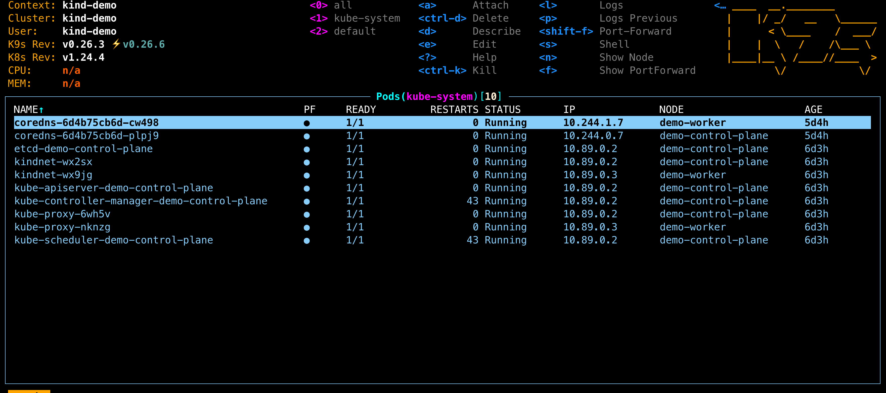

# K9s

[K9s](https://github.com/derailed/k9s) is a terminal interface which will help get a dynamic view of a cluster.

Install is straightforward, it’s a single binary, and it connect to the current context by default

## Install

=== "MacOsX"
    ```bash
    brew install k9s
    ```

=== "Go"
    ```bash
    # NOTE: The dev version will be in effect!
    go install github.com/derailed/k9s@latest
    ```

    !!! warning
        Go install seems to be broken...

## Usage

Here are some of the basic command line options to start `k9s`:

- `k9s -n <namespace>`: 
    start k9s within a specific namespace

- `k9s --context <context>`: 
    start k9s using another context than the selected one

- `k9s --readonly`: 
    start k9s in read-only mode, to ensure you won't change any running resource

As `k9s` is a terminal console application, there's no mouse support or buttons to click. Here is a list of the most used commands you can use:

- `/<filter>`: to filter the list of resources, ex: /core to list only coredns pods
- `<ESC>`: to stop any command or clear filters
- `0`: to list pods from ALL namespaces
- `d`: (on a resource): describe the resource
- `e`: (on a resource): edit the resource (:q to quit, like in VI, depends on your EDITOR variable I guess)
- `l`: (on a resource): show logs
- `?`: help with possible commands
- `s`: (on a resource): open a shell in the container
- `<enter>`: (on a resource): view the resource content
- `y`: (on a resource): display yaml of the resource

## Examples

- Default k9s view

    

- Describe of a Pods

    

## Next

Leave the shell and use a 100% UI application in [next chapter](lens.md) !