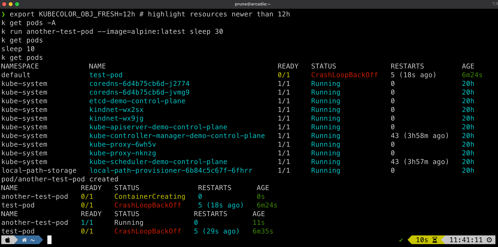

# kubecolor

As said on the [project's website](https://github.com/kubecolor/kubecolor): `Colorize your kubectl output`

!!! note 
    The kubecolor project, originally maintained in repo `https://github.com/hidetatz/kubecolor` has been supersedes by `https://github.com/kubecolor/kubecolor`.
    
    The previous maintainer wasn't answering to any bug/question and wasn't working on it anymore.

    [Prune](https://github.com/prune998) is now the maintainer of [Kubecolor](https://github.com/kubecolor/kubecolor) and is looking for other maintainers to help support it. Reach to [Prune](https://github.com/prune998) or [open an issue](https://github.com/kubecolor/kubecolor/issues) if you want to enroll as a maintainer or report an issue.

## Kubecolor in action

When using plain `kubectl`, everything is just grey (depends on your theme):


This is not really easy to read, and it's even worse when you have tons of outputs...

Then enters Kubecolor:


This new version also support the coloring for `kubectl ctx` and `kubectl ns` commands, along highlighting the new versus old resources with a user-customized duration. Set variable `KUBECOLOR_OBJ_FRESH` to a `h`, `m` or `s` duration.
## Install

=== "Apple Mac"

    ```bash title="kubecolor install"
    brew install kubecolor/tap/kubecolor
    ```

=== "Using Go"

    ```bash title="kubecolor install"
    VERSION=latest
    go install -ldflags="-X main.Version=${VERSION}" github.com/kubecolor/kubecolor/cmd/kubecolor@${VERSION}
    ```

## configuration

Usually you'll also replace all your `kubectl` commands by `kubecolor`.
Edit your `.zshrc` and add:

=== "ZSH"
    ```bash
    alias k=kubecolor
    compdef kubecolor=kubectl # only needed for zsh
    export KUBECOLOR_OBJ_FRESH=12h # highlight resources newer than 12h
    ```

    If you are using the `PowerLevel10k` theme for ZSH, edit the line defining `POWERLEVEL9K_KUBECONTEXT_SHOW_ON_COMMAND` in file `~/.p10k.zsh` to add `kubecolor` so it behave as `kubectl`:

    ```bash
      typeset -g POWERLEVEL9K_KUBECONTEXT_SHOW_ON_COMMAND='kubectl|helm|kubens|kubectx|oc|istioctl|kogito|k9s|helmfile|flux|fluxctl|stern|kubeseal|skaffold|kubie|terraform|terragrunt|kubecolor'
    ```


=== "BASH"
    ```bash
    alias k=kubecolor
    export KUBECOLOR_OBJ_FRESH=12h # highlight resources newer than 12h
    ```

`kubecolor` now behave the same as `kubectl`, with dynamic-prompt and completions:


### Demo

```bash
export KUBECOLOR_OBJ_FRESH=12h # highlight resources newer than 12h
k get pods -A
k run another-test-pod --image=alpine:latest sleep 30
k get pods
sleep 10
k get pods
```


