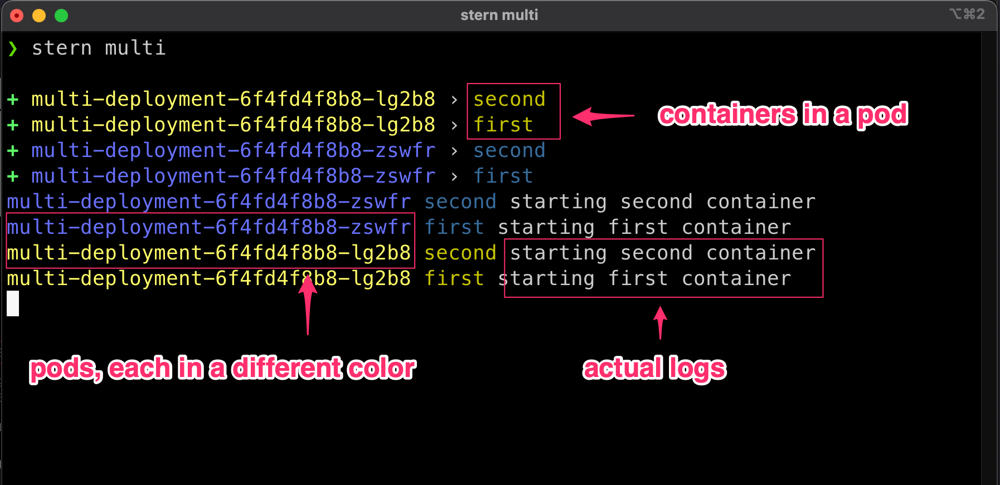

# Stern

[Stern](https://github.com/stern/stern) allows you to tail multiple pods on Kubernetes and multiple containers within the pod. Each result is color coded for quicker debugging.

## Install

!!! warning
    Note that the [original Stern repo](https://github.com/wercker/stern) was forked at [https://github.com/stern/stern](https://github.com/stern/stern) as the other one is not maintained anymore.

=== "Apple MacOsX"

    ```bash
    brew install stern
    ```

=== "Go"

    ```bash
    go install github.com/stern/stern@latest
    ```

=== "Krew"

    ```bash
    kubectl krew install stern
    ```

## Usage

We usually use some commands like `k logs -n kube-system -l k8s-app=kube-dns` which will dump the logs from the coredns pods:


This is pretty much complicated as you have to select one container from one pod from one namespace, or use complex selectors, which will dump the logs without much way of knowing which log comes from which pod.

[Stern](https://github.com/stern/stern) is a small app that extend how logs are dumped, adding the name of the pod, the container inside the pod, and using colors to differentiate which is which. It also add an easier way to select the pods to display.

While we had to use a label selector to dump the logs of kube-dns using k log, we can use `stern` like: `stern -n kube-system coredns`


Here's a detailed explanation:



Stern is really versatile, and here are some command examples, based on the previous `coredns` logs:

- search pods per labels (as with `k logs`)
    ```bash
    stern -n kube-system -l k8s-app=kube-dns
    ```
    ```bash
    + coredns-6d4b75cb6d-cw498 › coredns
    + coredns-6d4b75cb6d-plpj9 › coredns
    coredns-6d4b75cb6d-plpj9 coredns [INFO] plugin/ready: Still waiting on: "kubernetes"
    coredns-6d4b75cb6d-cw498 coredns .:53
    coredns-6d4b75cb6d-plpj9 coredns .:53
    ```
- search pods in all namespaces
    ```bash
    stern coredns --all-namespaces
    ```
    ```bash
    + kube-system coredns-6d4b75cb6d-plpj9 › coredns
    + kube-system coredns-6d4b75cb6d-cw498 › coredns
    kube-system coredns-6d4b75cb6d-cw498 coredns .:53
    kube-system coredns-6d4b75cb6d-plpj9 coredns .:53
    ```
- Exclude some logs with a matching pattern
    ```bash
    # exclude logs with [INFO]
    stern -n kube-system coredns --exclude "[INFO]"
    ```
    ```bash
    + coredns-6d4b75cb6d-plpj9 › coredns
    + coredns-6d4b75cb6d-cw498 › coredns
    coredns-6d4b75cb6d-cw498 coredns .:53
    coredns-6d4b75cb6d-plpj9 coredns .:53
    coredns-6d4b75cb6d-cw498 coredns linux/amd64, go1.17.1, 13a9191
    coredns-6d4b75cb6d-plpj9 coredns linux/amd64, go1.17.1, 13a9191
    ```
- Tail only the latest logs (drop old logs)
    ```bash
    stern -n kube-system coredns --tail 1
    ```
    ```bash
    + coredns-6d4b75cb6d-plpj9 › coredns
    + coredns-6d4b75cb6d-cw498 › coredns
    coredns-6d4b75cb6d-cw498 coredns linux/amd64, go1.17.1, 13a9191
    coredns-6d4b75cb6d-plpj9 coredns linux/amd64, go1.17.1, 13a9191
    ```
- Tail logs in Json
    This is great as you can use `jq` to pretty-print the logs, or apply some complex `json` filtering:
    ```bash
    stern -n kube-system coredns --output json | jq '.'
    ```
    ```bash
    + coredns-6d4b75cb6d-cw498 › coredns
    + coredns-6d4b75cb6d-plpj9 › coredns
    {
      "message": "[INFO] plugin/ready: Still waiting on: \"kubernetes\"",
      "nodeName": "demo-control-plane",
      "namespace": "kube-system",
      "podName": "coredns-6d4b75cb6d-plpj9",
      "containerName": "coredns"
    }
    {
      "message": ".:53",
      "nodeName": "demo-control-plane",
      "namespace": "kube-system",
      "podName": "coredns-6d4b75cb6d-plpj9",
      "containerName": "coredns"
    }
    ...
    ```

    !!!note 
        The real log message is in the `message` field, and is encoded. In the case your logs are already JSON, they will be double-encoded, and not pure JSON.

        The latest version of Stern (`1.22.0` or newer) inclused two other `--ouptput` modes: 
        - extjson
            This is an extended JSON output, used when your logs are already JSON. In this case, they will not be double-encoded.
        - ppextjson
            This is the same as above but keeping the stern colors to identify pods and adding pretty-print indentation so it not necessary to use `jq`
